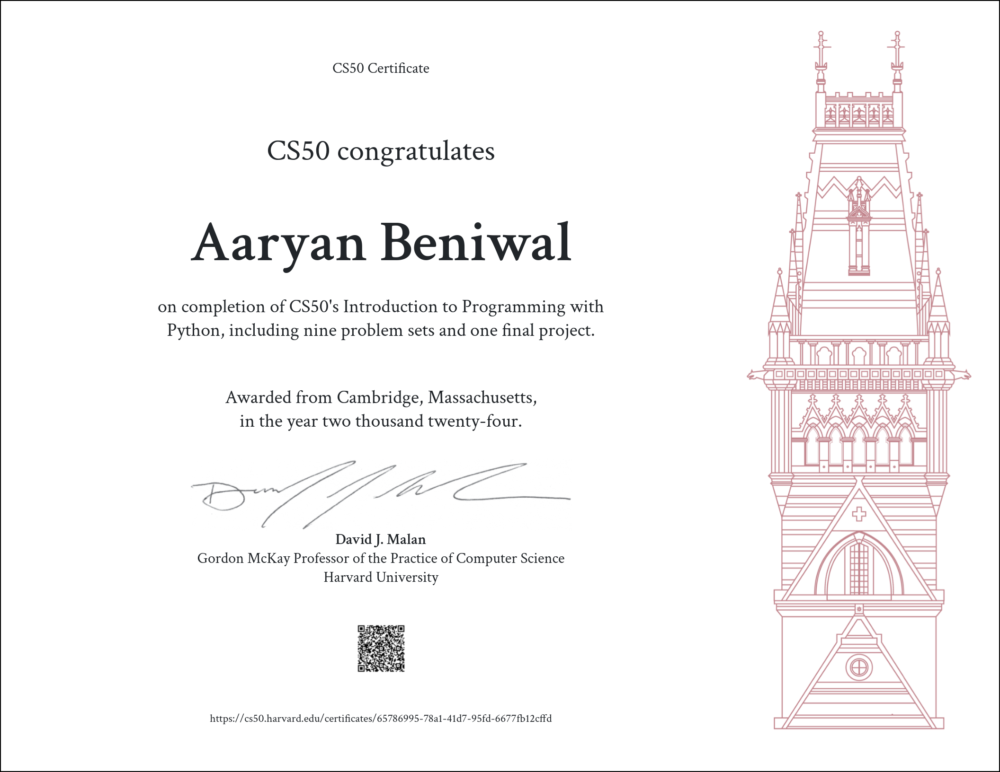

# Type-Test: Level Up Your Typing Skills with a Fun and Engaging Game (Python)
    
#### Description: 
This project introduces Type-Test, a Python-based game designed to enhance your typing speed and accuracy in a fun and interactive way. It leverages random sentence generation to create a dynamic practice environment, keeping your typing sessions fresh and engaging.Slight Alteration of the Following Project was used as final project for Harvard's CS50x: Introduction to Programming with Python Course. The Certificate is attatched below -

## Features

* **Random Sentence Generation:** Encounter sentences of varying lengths (typically 18-25 words) to challenge your typing skills and improve overall adaptability.
* **Real-time Feedback:** Get immediate WPM (Words Per Minute) and accuracy scores to track your progress and identify areas for improvement.
* **Motivational Design:** See your typing speed increase over time, fostering a sense of accomplishment and encouraging further practice.

## How It Works

1. Launch the Type-Test application.
2. A random sentence will appear on the screen.
3. Start typing the sentence as accurately as possible.
4. Once you finish typing, the game will display your WPM and accuracy scores.
5. You can choose to replay with a new sentence or end the practice session.

## Benefits

* Improve typing speed and accuracy, leading to increased efficiency in everyday tasks.
* Enhance communication and productivity by reducing time spent typing.
* Make learning to type a fun and rewarding experience, especially for beginners.

## Target Audience

Type-Test is beneficial for anyone who wants to improve their typing skills, regardless of experience level:

* Students: Boost typing proficiency for academic assignments and research.
* Professionals: Enhance communication and document creation speed in the workplace.
* Casual Users: Learn to type in a fun and interactive way, making daily tasks more efficient.

